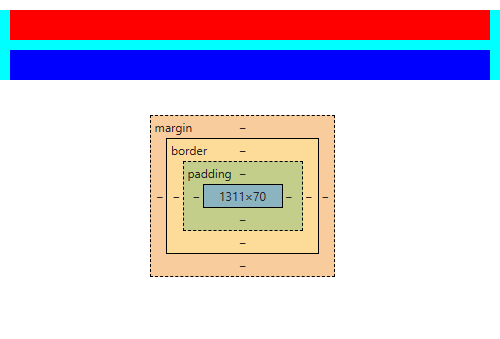

# CSS盒子模型
盒模型都是由四个部分组成的，分别是margin、border、padding和content
## W3C盒模型与IE盒模型
W3C标准盒模型：属性width，height只包含内容content，不包含border和padding

IE盒模型：属性width，height包含content、border和padding，指的是content +padding+border。

## 元素大小
```js
// todo: offset啥的说一下
```

## margin
### margin 叠加
问大家一个问题：_有两个div元素，其高为10px，内边距为10px，外边距为10px，请问这两个div
的父元素的高度为？代码如下：_

```html
<div style="background-color: aqua">
  <div style="height: 10px;padding: 10px;margin: 10px;background-color: red"></div>
  <div style="height: 10px;padding: 10px;margin: 10px;background-color: blue"></div>
</div>
```
你可能会以为答案是`100px`，毕竟上下元素都是10px的内边，10px的外边，与10px的高。

但是答案是`70px`！是不是感到很意外？你可能会想，那30px去哪里了？

先说哪里少了，再说哪里去了。哪里少了呢？答案是**中间少了10px，两边各少了10px。**

先说中间的10px，两个元素如果满足：
- 处于常规文档流（非float和绝对定位）的块级盒子，并且处于同一个BFC当中 
- 没有空隙，没有padding和border将他们分隔开 
- 都属于垂直方向上相邻的外边距，可以是下面任意一种情况
  - 元素的margin-top与其第一个常规文档流的子元素的margin-top
  - 元素的margin-bottom与其下一个常规文档流的兄弟元素的margin-top 
  - height为auto的元素的margin-bottom与其最后一个常规文档流的子元素的margin-bottom
  - 高度为0并且最小高度也为0，不包含常规文档流的子元素，并且自身不是BFC的元素的margin-top
    和margin-bottom

那么margin就会发生合并。合并的意思是：**两个margin合成一个且其大小为较大的一个**

很明显，这里两个div满足`条件1和2`，并且满足`条件3的第二条`，因此两个margin发生合并，并且因为两个元素
的margin相同，则合并后的margin的高度为10px。

而对于上下两个边界的margin，其同样满足上述条件中的`条件1和2`，并且分别满足`条件3的第一条与第四条`，因此
上下两个边界的margin最终**成为了父元素的margin，且高度为10px，但margin并不计算在元素的高度中**。
因此，父元素的高度为70px

效果如下：



我已经将根元素的margin设置为0了，可以看到父元素的上方还是有10px的margin，同时如果查看子元素，
也可以看到margin的存在

## IFC
IFC（inline Formatting Context）叫做“行级格式化上下”
布局规则如下：
1. 内部的盒子会在水平方向，一个个地放置
2. IFC的高度，由里面最高盒子的高度决定
3. 当一行不够放置的时候会自动切换到下一行

## BFC
BFC（Block Formatting Context）叫做“块级格式化上下文"
布局规则如下：
1. 内部的盒子会在垂直方向，一个个地放置；
2. 盒子垂直方向的距离由margin决定， 属于同一个BFC的两个相邻Box的上下margin会发生重叠；
3. 每个元素的左边，与包含的盒子的左边相接触，即使存在浮动也是如此；
4. BFC的区域不会与float重叠；
5. BFC就是页面上的一个隔离的独立容器，容器里面的子元素不会影响到外面的元素，反之也如此；
6. 计算BFC的高度时，浮动元素也参与计算。

产生BFC的原因
1. 根元素；
2. float的属性不为none；
3. position为absolute或fixed；
4. display为inline-block，table-cell，table-caption，flex；
5. overflow不为visible