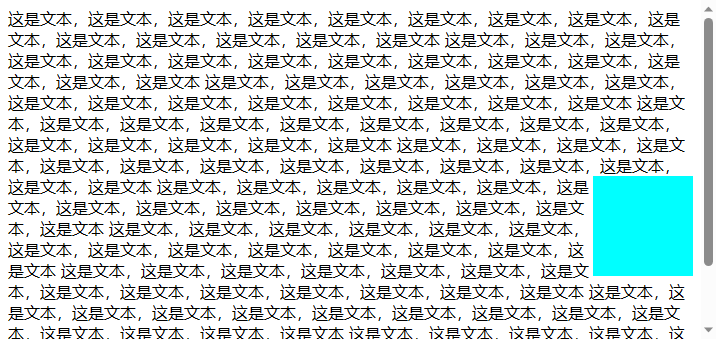
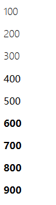

# 文本
CSS的文本还是挺有意思的，子曰：

> 夫兵形象水 —— 《孙子兵法》

文字的形态也像水，我们很难改变水的形态，但偶尔我们能改变水的流向。比如我们在根元素中加入一个bfc元素比如
`float`，那么文字就会避开这个元素



## 基本属性
写在标签中的文本的属性通过修改标签中的font属性来更改，这应该是css基础知识中的内容了，此处简单提一下：

- `color:<color>`：文字颜色
- `font-style`：文字样式，比如斜体或粗体
- `font-variant`：变体，属性挺多的不说了
- `font-weight`：字体粗细
- `font-size`：字体大小
- `line-height`：行高
- `font-family`：字体族
- `font：[ [ <'font-style'> || <font-variant-css21> || <'font-weight'> || 
<'font-stretch'> ]? <'font-size'> [ / <'line-height'> ]? <'font-family'> ]`:集合元素

### font-weight
字体粗细其实还比较好理解吧，注意不要和字体大小弄混，粗细是指字体的笔画的粗细，就像用0.5和1.0的笔写出来的
字粗细不同一样。

值得注意的是，font-weight 虽然有100 - 900 这9个可以取到的值，但是这些值是否起作用取决于操作系统与
字体。



可以看到其实Windows平台下使用默认字体其实只有细、中、粗这几个值，而使用苹果的苹方字体则不同

### font-family
字体族用来设置字体。

既然都说是字体**族**了，那么肯定是可以设置多个字体值。如果我们字在前面的字体中已经包含，就会直接使用前面的字体，
找不到则会继续往后找，如果最后还是找不到就用默认字体（默认字体没有就是`?`或者`□`）

其实这个设计最初是为了防止我们定义的字体文件在用户电脑中没有，比如

```css
.test{
    font-family: "Microsoft YaHei UI", "华文楷体" ,serif ;
}
```

如果用户的电脑没有雅黑则使用楷体，如果没有楷体则使用衬线体。（还挺人性化的不是）

当然，你也可以做一些其他有趣的事情，比如将中文与英文，或者简体与繁体设置不同的字体。
比如中文与英文设置不同字体，则只需要**将英文字体放在中文字体前面**

#### 加载网络字体
当然我们也可以让用户使用我们设置的字体文件咯，方法很简单：

> 摘自千古前端

```css
/*声明字体*/
@font-face {
    font-family: 'webfont';
    src: url('webfont.eot'); /* IE9*/
    src: url('webfont.eot?#iefix') format('embedded-opentype'), /* IE6-IE8 */
    url('webfont.woff') format('woff'), /* chrome、firefox */
    url('webfont.ttf') format('truetype'), /* chrome、firefox、opera、Safari, Android, iOS 4.2+*/
    url('webfont.svg#webfont') format('svg'); /* iOS 4.1- */
}

/*定义使用字体的样式*/
.web-font{
    font-family:"webfont",serif !important;
    font-size:16px;font-style:normal;
    -webkit-font-smoothing: antialiased;
    -webkit-text-stroke-width: 0.2px;
    -moz-osx-font-smoothing: grayscale;
}
/*然后就可以使用了*/
```

当然，url中可以使用网络连接，至于跨域问题嘛，自己解决咯！（可以反向代理配置跨域或者使用base64，按需使用呗）

