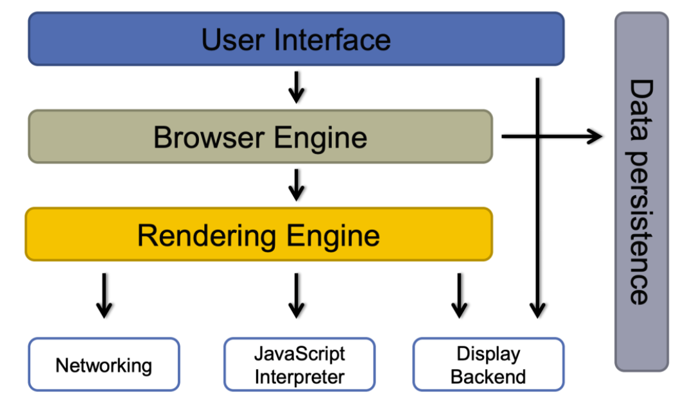

# 浏览器
## 浏览器的结构

现代浏览器基本上是由上图所述的部分组成：
1. 用户接口：为用户提供用户交互界面
2. 浏览器引擎：负责处理用户的各种行为，初始化加载URL，协调UI与渲染引擎等
3. 渲染引擎：解析JS、CSS、HTML等，渲染界面
4. JS解释器：解释和运行JS代码并将结果传递给渲染引擎
5. 数据存储：存储书签、缓存等数据

主流浏览器的渲染引擎与JS解释器版本如下(2023.3)：

| 浏览器     | 渲染引擎    | JS解释器          |
|---------|---------|----------------|
| Chrome  | Blink   | V8             |
| IE      | Trident | Chakra         |
| Firefox | gecko   | spiderMonkey   |
| Safari  | webKit  | JavaScriptCore |
| Opera   | Blink   | CaraKan        |
| Edge    | Blink   | V8             |

## 浏览器缓存
浏览器的缓存机制指的是通过在一段时间内保留已接收到的 web 资源的一个副本，如果在资源的有效时间内，
发起了对这个资源的再一次请求，那么浏览器会直接使用缓存的副本，而不是向服务器发起请求。
使用 web 缓存可以有效地提高页面的打开速度，减少不必要的网络带宽的消耗。

web 资源的缓存策略一般由服务器来指定，可以分为两种，分别是强缓存策略和协商缓存策略。

### 强制缓存
如果缓存资源有效，则直接使用缓存资源，不必再向服务器发起请求。
强缓存策略可以通过两种方式来设置，分别是 http 头信息中的 Expires 属性和 Cache-Control 属性。
#### Expires
服务器通过在响应头中添加 Expires 属性，来指定资源的过期时间。
在过期时间以内，该资源可以被缓存使用，不必再向服务器发送请求。
这个时间是一个绝对时间，它是服务器的时间，因此可能存在这样的问题，
就是客户端的时间和服务器端的时间不一致，或者用户可以对客户端时间进行修改的情况，
这样就可能会影响缓存命中的结果。
#### Cache-Control
Expires 是 http1.0 中的方式，因为它的一些缺点，
在 http 1.1 中提出了一个新的头部属性就是 Cache-Control 属性， 它提供了对资源的缓存的更精确地控制。

它有很多不同的值，如下：
- **max-age**（单位为s）指定设置缓存最大的有效时间，定义的是时间长短。当浏览器向服务器发送请求后，在max-age这段时间里浏览器就不会再向服务器发送请求了。
- **s-maxage**（单位为s）同max-age，只用于共享缓存（比如CDN缓存）。
- **public** 指定响应会被缓存，并且在多用户间共享
- **private** 响应只作为私有的缓存（见下图），不能在用户间共享。如果要求HTTP认证，响应会自动设置为private。
- **no-cache** 代表该资源能够被缓存，但是立即失效，每次都需要向服务器发起请求
- **no-store** 用来指定资源不能够被缓存
- **must-revalidate** 指定如果页面是过期的，则去服务器进行获取

当两种方式一起使用时，**Cache-Control 的优先级要高于 Expires**
### 协商缓存
使用协商缓存策略时，会先向服务器发送一个请求，如果资源没有发生修改，则返回一个 304 状态， 让浏览器使用本地的缓存副本。
如果资源发生了修改，则返回修改后的资源。
协商缓存也可以通过两种方式来设置，分别是 http 头信息中的 Etag 和 Last-Modified 属性。
#### Last-Modified
服务器通过在响应头中添加 Last-Modified 属性来指出资源最后一次修改的时间，
当浏览器下一次发起请求时，会在请求头中添加一个 If-Modified-Since 的属性，
属性值为上一次资源返回时的 Last-Modified 的值。
当请求发送到服务器后服务器会通过这个属性来和资源的最后一次的修改时间来进行比较， 以此来判断资源是否做了修改。
如果资源没有修改，那么返回 304 状态，让客户端使用本地的缓存。
如果资源已经被修改了，则返回修改后的资源。

使用这种方法有一个缺点，就是 Last-Modified 标注的最后修改时间只能精确到秒级，
如果某些文件在1秒钟以内，被修改多次的话，那么文件已将改变了但是 Last-Modified 却没有改变，
这样会造成缓存命中的不准确。
#### Etag
服务器在返回资源的时候，在头信息中添加了 Etag 属性，这个属性是资源生成的唯一标识符，
当资源发生改变的时候，这个值也会发生改变。
在下一次资源请求时，浏览器会在请求头中添加一个 If-None-Match 属性，
这个属性的值就是上次返回的资源的 Etag 的值。
服务接收到请求后会根据这个值来和资源当前的 Etag 的值来进行比较，以此来判断资源是否发生改变， 是否需要返回资源。
通过这种方式，比 Last-Modified 的方式更加精确。

当 Last-Modified 和 Etag 属性同时出现的时候，**Etag 的优先级更高**。

使用协商缓存的时候，服务器需要考虑负载平衡的问题，因此多个服务器上资源的 Last-Modified 应该保持一致，
因为每个服务器上 Etag 的值都不一样，因此在考虑负载平衡时，最好不要设置 Etag 属性。

强缓存策略和协商缓存策略在缓存命中时都会直接使用本地的缓存副本，区别只在于协商缓存会向服务器发送一次请求。
它们缓存不命中时，都会向服务器发送请求来获取资源。在实际的缓存机制中，强缓存策略和协商缓存策略是一起合作使用的。
浏览器首先会根据请求的信息判断，强缓存是否命中， 如果命中则直接使用资源。
如果不命中则根据头信息向服务器发起请求，使用协商缓存，如果协商缓存命中的话，则服务器不返回资源，
浏览器直接使用本地资源的副本，如果协商缓存不命中，则浏览器返回最新的资源给浏览器。

## 浏览器存储
### Cookie
cookie是纯文本，没有可执行代码。

#### 特征
1. 不同的浏览器存放的cookie位置不一样，也是不能通用的。 
2. cookie的存储是以域名形式进行区分的，不同的域下存储的cookie是独立的。 
3. 我们可以设置cookie生效的域（当前设置cookie所在域的子域），也就是说，我们能够操作的cookie是当前域以及当前域下的所有子域 
4. 一个域名下存放的cookie的个数是有限制的，不同的浏览器存放的个数不一样,一般为20个。 
5. 每个cookie存放的内容大小也是有限制的，不同的浏览器存放大小不一样，一般为4KB。 
6. cookie也可以设置过期的时间，默认是会话结束的时候，当时间到期自动销毁

#### 读取
通过`document.cookie`得到网站下所有的cookie的字符串形式的值
#### 写入
`document.cookie = '名字=值';`
客户端可以设置cookie 的下列选项：expires、domain、path、secure（有条件：只有在https协议的网页中，客户端设置secure类型的 cookie 才能成功），
但无法设置HttpOnly选项。
#### 修改
修改一个cookie，只需要重新赋值就行，旧的值会被新的值覆盖。
但要注意一点，在设置新cookie时，path/domain这几个选项一定要旧cookie 保持一样。
否则不会修改旧值，而是添加了一个新的 cookie。
#### 删除
把要删除的cookie的过期时间设置成已过去的时间,path/domain/这几个选项一定要旧cookie 保持一样。
#### 属性
- 过期时间：如果我们想长时间存放一个cookie。需要在设置这个cookie的时候同时给他设置一个过期的时间。
如果不设置，cookie默认是临时存储的，当浏览器关闭进程的时候自动销毁

    ```js
    document.cookie = '名称=值;expires=' + GMT(格林威治时间)格式的日期型字符串;
    ```
- 域domain：domain指定了 cookie 将要被发送至哪个或哪些域中。 默认情况下，domain 会被设置为创建该 
cookie 的页面所在的域名，所以当给相同域名发送请求时该 cookie 会被发送至服务器。
    ```js
    document.cookie = "username=xxx;path=/;domain=qq.com"
    ```
- path：默认情况下，只有与创建 cookie 的页面在同一个目录或子目录下的网页才可以访问。
  即path属性可以为服务器特定文档指定cookie，这个属性设置的url且带有这个前缀的url路径都是有效的。
    ```js
    document.cookie = "username=xxx; path=/"
    ```
- secure：用来设置cookie只在确保安全的请求中才会发送。当请求是HTTPS或者其他安全协议时，
包含 secure 选项的 cookie 才能被发送至服务器。
    ```js
    document.cookie = "username=xxx; secure"
    ```
- httpOnly：当cookie带httpOnly选项时，客户端则无法通过js代码去访问（包括读取、修改、删除等）这个cookie。
在客户端是不能通过js代码去设置一个httpOnly类型的cookie的，这种类型的cookie只能通过服务端来设置。
### LocalStorage
#### 特征
1. 生命周期：持久化的本地存储，除非主动删除数据，否则数据是永远不会过期的。 
2. 存储的信息在同一域中是共享的。 
3. 当本页操作（新增、修改、删除）了localStorage的时候，本页面不会触发storage事件,但是别的页面会触发storage事件。 
4. 大小：据说是5M（跟浏览器厂商有关系） 
5. 在非IE下的浏览中可以本地打开。IE浏览器要在服务器中打开。 
6. localStorage本质上是对字符串的读取，如果存储内容多的话会消耗内存空间，会导致页面变卡 
7. localStorage受同源策略的限制

#### 写入
```js
localStorage.setItem('key','value');
```
#### 获取
```js
localStorage.getItem('key')
// 或获取第n个键名
localStorage.key(0)
```
#### 删除
```js
localStorage.removeItem('username')
// 清除所有存储
localStorage.clear()
```
#### Storage事件
当storage发生改变的时候触发。

当前页面对storage的操作会触发其他页面的storage事件
### SessionStorage
和localStorage类似
#### 特征
1. sessionStorage要求协议、主机名、端口相同并且在同一窗口（也就是浏览器的标签页）下，才能读取/修改到同一份数据 
2. sessionStorage当会话结束（当前页面关闭的时候，自动销毁）
### web SQL database
已弃用
### indexedDB
indexedDB 是一个基于JavaScript的面向对象的数据库。 
#### 特征
1. IndexedDB允许存储和检索用键索引的对象 
2. 支持持久化存储，存储的大小由浏览器决定，最小也有512MB 
3. 同一个数据库只能在同源的界面访问
#### 创建数据库
创建时设置键与索引
#### 获取数据
允许使用键、索引与游标获取数据
#### 写入数据
键值对的形式写入
## 识别用户的方式
因为HTTP是无状态协议，所以我们需要一种方法来验证请求者的身份

当然，最简单的方法是每次都上传用户名和密码，但这是这增加了大量重复的代码，编码与维护都相当的困难
### Cookie
前面我们已经讲到了浏览器如何操作Cookie，现在我们将阐述如何使用Cookie鉴别身份

Cookie可以由服务器生成，发送并储存在浏览器中。当浏览器向服务器发起HTTP请求时，**未过期**的Cookie将会
**自动**添加到请求头中。

#### Cookie跨域
Cookie在跨域的HTTP请求中将会被禁用（关于跨域的HTTP请求见http章）

想要给后端传递cookie需要使用withCredentials属性，设置withCredentials为true

```js
var xhr = new XMLHttpRequest()
xhr.withCredentials = true
```

如果依然收不到Cookie，可能还需要在set-cookie时将cookie的sameSite设置为none；
又由于将sameSite设置为none时，也需要将Secure设置上，所以请求需要基于https

#### Cookie的缺点
不要用Cookie储存敏感数据，比如密码
### Session
使用Cookie储存信息时，每次都需要传递比较多的数据，这无疑会加重服务器的负担。
为了减轻服务器的和网络的压力，Session出现了

Session机制是一种服务器端的机制，服务器使用一种类似于散列表的结构（也可能就是使用散列表）来保存信息。

Session将用户交互信息保存在了服务器端，同一个客户和服务端交互时只要传回一个ID，
这个ID是客户端第一次访问服务器的时候生成的，而且每个客户端是唯一的。
这样就实现了一个ID就能在服务器取得所有的用户交互信息。

一般情况下客户端session的ID都是通过Cookie的方式与服务器交互的

#### Session生命周期
Session在以下情况会被删除失效：
1. Session超时：时间服务器在设置的Session超时的最大时间内没有收到该Session所对应客户端的请求 
2. 程序调用方法主动销毁session 
3. 服务器关闭或服务停止

### Token

JSON Web Token（JWT）定义了以一种紧凑的、自包含的 JSON 对象在各方之间安全传输信息的方式。
该信息含有数字签名，可以被验证和信任。

#### Token的工作方式
1. 前端发送账号密码到服务器
2. 服务器验证账号密码
3. 验证通过后将用户信息加密生成的token字符串发送到前端
4. 前端收到后将token存入localStorage或者SessionStorage
5. 前端再次发送请求时将token返回服务器
6. 服务器解密token并与用户信息的明文比较，若通过则返回用户请求的信息

#### Token的组成成分
JWT 的三个组成部分，从前到后分别是 Header、Payload、Signature

Payload部分才是真正的用户信息，它是用户信息经过加密之后生成的字符串

Header和Signature是安全性相关的部分，只是为了保证Token的安全性