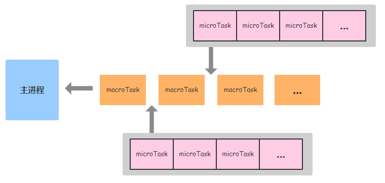

# JS的同步与异步
同步，可以理解为在执行完一个函数或方法之后，一直等待系统返回值或消息，这时程序是处于阻塞的，
只有接收到返回的值或消息后才往下执行其他的命令。

异步，执行完函数或方法后，不必阻塞性地等待返回值或消息，只需要向系统委托一个异步过程，
那么当系统接收到返回值或消息时，系统会自动触发委托的异步过程，从而完成一个完整的流程。

## JS异步编程
为啥要用Promise

在Promise出现之前，异步任务需要用回调

**与回调函数相比，Promise的优点**

- 指定回调函数的方式更灵活，可以启动异步任务之后再指定
- 支持链式调用，解决回调地狱问题


### Promise的使用

#### 手动封装

```js
let p = new Promise((reslove,reject)=>{
     fs.readFile('./xxx.xxx',(err, data)=>{
        if(err) reject(err)
        resolve(data)    
    })
})


p.then(value=>{
    console.log(value.toString())
}, reason=>{
    console.log(reason)
})
```

#### 使用Utils.promisify转换

```js
const utils = require('utils')
const fs = require('fs')
let mineReadFile = util.promisify(fs.readFile)
mineReadFile('./xxx.xxx').then(value=>{
    console.log(value.toString())
})
```

### promise的状态

Promise的状态指的是实例对象中的`PromiseState`对象

对象的值有：

- padding 未决定的

- resolved / fulfilled 成功

- rejected 失败


#### promise的状态转变

可以由padding变为其他两种，且一个promise对象只能改变一次

成功和失败都会有一个结果数据

- 成功：value
- 失败：reason


### Promise对象的值

实例对象中的另一个值`PromiseResult`，保存异步任务成功/失败的结果，值为

- 成功 resolve
- 失败 reject


### Promise的工作流程

### Promise的API

#### Promise构造函数

```js
new Promise()
```

#### Promise.resolve

```js
let p1 = Promise.resolve(new Promise|any)
// 如果传入的参数是一个非Promise对象，则返回一个成功的Promise对象
// 如果是一个Promise对象，参数的结果决定resolve的结果
```

#### Promise.reject

```js
let p1 = Promise.reject(Promise|any)
// 不管传入什么都是失败的，并且参数是失败的原因
```

#### Promise.all

```js
const result = Promise.all(Promise[])
// 参数是一个Promise数组，只有参数中的Promise都成功，才会成功
```

#### Promise.race

```js
const result = Promise.all(Promise[])
// 参数是一个Promise数组，是否成功由第一个先改变状态的的Promise决定
```

### 几个关键问题

#### 如何改变Promise对象的状态？

- 调用resolve函数
- 调用reject函数
- 抛出错误


#### 指定多个成功（失败）的<u>回调函数</u>，都会执行吗？

都会执行

#### 改变Promise状态和指定回调函数谁先谁后？

**都有可能**

当执行器函数是同步任务时，先改变状态

当执行器是异步任务时，先指定回调

#### Promise.then()返回的Promise的结果由谁决定？

由执行的结果决定

- 抛出错误，结果失败
- 返回结果是非Promise类型对象，结果成功
- 如果返回了一个Promise对象，则返回的Promise结果与之相同


#### Promise如何串联多个任务？

`Promise.then()`返回一个Promise对象，可以继续调用then()

#### 异常穿透

在串联的多个任务中，只需要在最后定义失败的回调即可处理任意一个任务中的错误

#### 中断Promise链

当返回一个Pending状态的Promise对象，则后续的.then方法都不会执行

### 自定义Promise

```js
function Promise(executor){
    // Promise的状态，初始状态为pending
    // 成功时的状态为fulfilled，失败时的状态为rejected
    // Promise的状态可以从pending变为fulfilled或者rejected
    // 但是其他的状态不能随意变化
    this.PromiseState = 'pending'
    // 即传入resolve方法或rejected方法的值
    this.PromiseResult = null
    // 回调函数列表，当调用then()方法时，将传入的两个方法加入到回调函数列表
    this.callbacks = []
    const _this = this
    function resolve(data){
        // 如果不是pending则不能正常执行
        if(_this.PromiseState !== 'pending'){
            return
        }
        _this.PromiseState = 'fulfilled'
        _this.PromiseResult = data
        // 模拟异步执行，虽然setTimeout是宏任务队列，所以这里实际上有点问题，不过对于模拟异步是足够了
        setTimeout(()=>{
            // 逐个调用所有的回调函数的处理resolved的函数
            _this.callbacks.forEach(item =>{
                item.onResolved(data)
            })
        })
    }
    function reject(data){
        if(_this.PromiseState !== 'pending'){
            return
        }
        _this.PromiseState = 'rejected'
        _this.PromiseResult = data
        setTimeout(()=>{
            // 逐个调用所有的回调函数的处理rejected的函数
            _this.callbacks.forEach(item =>{
                item.onRejected(data)
            })
        })
    }
    // 为传进来的函数自动传入resolve和reject两个方法
    // 实际上我们传入的函数就是需要这两个函数的形式
    try {
        executor(resolve,reject);
    }catch (e){
        // 如果执行错误使用reject处理即可
        reject(e)
    }
}

/**
 * 根据promise的state运行指定的函数（即把函数绑定到Promise的回调上
 * @param {function} onResolved 成功时的回调
 * @param {function} onRejected 失败时的回调
 * @return {Promise} 返回一个Promise对象以维持Promise链
 */
Promise.prototype.then = function (onResolved, onRejected){
    const _this = this
    // 如果onRejected不是函数则绑定默认函数
    // 默认函数为接受一个参数reason并抛出错误
    if(typeof onRejected !== "function"){
        onRejected = reason =>{
            throw reason
        }
    }
    // 如果onResolved不是函数则绑定默认函数
    // 默认函数为接受一个参数并原样返回
    if(typeof onResolved !== "function"){
        onResolved = value => value
    }
    return new Promise((resolve,reject)=>{
        /**
         * 如果Promise的状态已经改变再调用then就只需要根据状态调用想用的处理方法即可
         * @param type 状态，成功则是onResolved，失败则是onRejected
         */
        function callback(type){
            try {
                // 对Promise的结果运行传入的处理函数
                let result = type(_this.PromiseResult);
                // 如果获取的结果还是一个Promise则继续调用
                if(result instanceof Promise){
                    result.then(v =>{
                        resolve(v)
                    },r=>{
                        reject(r)
                    })
                }else{
                    // 如果是普通值则直接调用resolve方法
                    resolve(result)
                }
            }catch (e){
                // 如果上面抛出了rejected值必须在此处理
                reject(e)
            }
        }
        if(this.PromiseState === 'fulfilled'){
            setTimeout(()=>{
                callback(onResolved)
            })
        }
        if(this.PromiseState === 'rejected'){
            setTimeout(()=>{
                callback(onRejected)
            })

        }
        // 当promise未曾调用则将两个方法传入callback再将callback传入Promise的callback队列
        if(this.PromiseState === 'padding'){
            this.callbacks.push(
                {
                    'onResolved':function (){
                        callback(onResolved)
                    },
                    'onRejected':function (){
                        callback(onRejected)
                    },
                }
            )
        }
    })
}

/**
 * catch 就是 then 第一个参数为undefined或null的版本
 * @param onRejected
 */
Promise.prototype.catch = function (onRejected){
    this.then(undefined,onRejected);
}

/**
 * 传入一个不是Promise的参数返回一个成功的且值为value的Promise
 * @param value 需要包装为Promise的值
 * @return {Promise} 包装后的Promise
 */
Promise.resolve = function (value){
    return new Promise((resolve,reject)=>{
        if(value instanceof Promise){
            value.then(v=>{
                resolve(v)
            },r=>{
                reject(r)
            })
        }else{
            resolve(value)
        }
    })
}

/**
 * 返回一个失败的且值为value的Promise
 * @param reason 失败的原因，即返回的失败的Promise的值
 * @return {Promise} 包装后的Promise
 */
Promise.reject = function (reason){
    return new Promise((resolve,reject)=>{
        reject(reason)
    })
}

/**
 * 传入一个Promise数组，入过都成功返回成功的值组成的数组的Promise，否则返回一个失败的值的Promise
 * @param promises
 * @return {Promise}
 */
Promise.all = function (promises){
    return new Promise((resolve,reject)=>{
        let count = 0
        const arr=[]
        for(let i=0;i<promises.length;i++){
            if(!promises[i] instanceof Promise){
                count++
                arr[i] = promises[i]
            }
            promises[i].then(v=>{
                count++
                arr[i]=v
                if(count===promises.length){
                    resolve(arr)
                }
            },r => {
                reject(r)
            })
        }
    })
}

/**
 * 传入一个Promise数组，返回第一个成功或失败的Promise的值的Promise
 * @param promises
 * @return {Promise}
 */
Promise.race = function (promises){
    return new Promise((resolve,reject)=>{
        for(let i=0;i<promises.length;i++){
            promises[i].then(v=>{
                resolve(v);
            },r=>{
                reject(r);
            })
        }
    })
}
```

<font color="yellow">美团</font>面试题：创建一个函数接收一个数字表示同时运行的最大Promise数，这个函数
返回一个函数，这个返回的函数接受一个Promise将其转化为有最大执行数限制的Promise，使其在Promise.all中能够
同时运行的Promise数量不超过最大Promise数

```js
function pLimit(time){
    // 维护一个Promise池
    let pool = [];
    // 目前从池子中取出了几个Promise
    let count = 0;

    /**
     * 调度器，负责从池子中取出Promise运行并在运行结束后通知下一个Promise运行
     */
    function run(){
        // 如果不超过最大数量并且池子非空，则取出下一个运行
        if(count<time && pool.length){
            count++;
            const {fn,resolve,reject} = pool.shift()
            fn().then(res=>{
                resolve(res)
            }).catch(err=>{
                reject(err)
            }).finally(()=>{
                // 在结束之后将count减一并调用下一个promise
                count--;
                run();
            })
        }
    }
    // 返回一个limit函数，这个函数接受一个返回Promise的函数，并将其转化为拥有最大执行数限制的Promise
    return function limit(fn){
        return new Promise((resolve, reject) => {
            pool.push({fn,resolve,reject});
            run();
        })
    }
}
```

下面再来看一道字节面试题。

```js
/*
  请实现一个 sum 函数，接收一个数组 arr 进行累加，并且只能使用add异步方法
  
  add 函数已实现，模拟异步请求后端返回一个相加后的值
*/
function add(a, b) {
  return Promise.resolve(a + b);
}
 
function sum(arr) {}
```

这道题最简单的做法是通过 async-await 的方式串行解决，但是这样的话会因为add是异步任务而导致效率低下。
所以最好能够使用一个并行的方法解决：

```js
function chunk(list, size) {
  const l = [];
  for (let i = 0; i < list.length; i++) {
    const index = Math.floor(i / size);
    l[index] ??= [];
    l[index].push(list[i]);
  }
  return l;
}

async function sum(arr) {
    if (arr.length === 1) return arr[0];
    // 将两个分成一组做加法
    const promises = chunk(arr, 2).map(([x, y]) =>
        // 注意此时单数的情况
        y === undefined ? x : add(x, y)
    );
    // 使用Promise.all同时请求所有两两相加的方法，再将得到的值传递给sum方法，递归的求结果之和
    return Promise.all(promises).then((list) => sum(list));
}
```

不过上述代码依然还存在问题。当并发量太大的时候，会一次性发出太多的网络请求导致网络堵塞。

现在再看看上面那一道美团的面试题，是不是有什么新的想法😋

### Generator

Generator 函数是协程在 ES6 的实现，最大特点就是可以交出函数的执行权（即暂停执行）。整个 Generator 函数就是一个封装的异步任务，或者说是异步任务的容器。异步操作需要暂停的地方，都用`yield`语句注明

```js
var gen = function* () {
    var f1 = yield readFile('/etc/fstab');
    var f2 = yield readFile('/etc/shells');
    console.log(f1.toString());
    console.log(f2.toString());
};
```

### async 与 wait

ES2017 标准引入了 async 函数，使得异步操作变得更加方便

```js
var asyncReadFile = async function () {
    var f1 = await readFile('/etc/fstab');
    var f2 = await readFile('/etc/shells');
    console.log(f1.toString());
    console.log(f2.toString());
};
```

#### 加上async修饰的函数

- 返回值为非Promise对象，返回一个成功的Promise对象，value为返回值
- 返回值为Promise对象，和返回的Promise相同
- 抛出错误，则返回失败的Promise对象


和then方法功能相同

#### await

- await右侧的表达式一般为promise对象,但也可以是其它的值
- 如果表达式是promise对象, await返回的是promise成功的值
- 如果表达式是其它值，直接将此值作为await的返回值


**注意**：

await必须写在Promise函数中，但是Promise函数可以没有await

如果await的Promise函数失败了，则会抛出异常，需要异常处理

## Event Loop

### MacroTask Queue（宏任务队列）

Event Loop 会有一个或多个 MacroTask Queue，这是一个先进先出（FIFO）的有序列表，存放着来自不同
**Task Source**（任务源）的 Task（也即MacroTask）。

> 关于 Task，常有人通俗地称它为 MarcoTask，但其实 HTML 标准中并没有这种说法。然而，为了方便理解，本书仍沿用通俗的称谓MacroTask。

在 HTML 标准中，定义了几种常见的 Task Source：

- DOM manipulation（DOM 操作）；
- User interaction（用户交互）；
- Networking（网络请求）；
- History traversal（History API 操作）。

MacroTask Source 的定义非常的宽泛，***常见的鼠标、键盘事件，AJAX，数据库操作（例如 IndexedDB）
，以及定时器相关的 setTimeout、setInterval*** 
等等都属于 Task Source，所有来自这些 MacroTask Source 的 MacroTask 都会被放到对应的 
MacroTask Queue 中等待处理。

对于 MacroTask、MacroTask Queue 和 Task Source，有如下规定：

1. 来自相同 Task Source 的 MacroTask，必须放在同一个 MacroTask Queue 中；
2. 来自不同 Task Source 的 MacroTask，可以放在不同的 MacroTask Queue 中；
3. 同一个 MacroTask Queue 内的 MacroTask 是按顺序执行的；
4. 但对于不同的 MacroTask Queue（Task Source），浏览器会进行调度，允许优先执行来自特定 Task Source 的 MacroTask。

### MicroTask Queue（微任务队列）

MicroTask Queue 与 MacroTask Queue 类似，也是一个有序列表。不同之处在于，
**一个 Event Loop 只有一个 MicroTask Queue**。

在 HTML 标准中，并没有明确规定 MicroTask Source，通常认为有以下几种：

- Promise

> 在 Promises/A+ Note 3.1 中提到了 then、onFulfilled、onRejected 的实现方法，
> 但 Promise 本身属于平台代码，由具体实现来决定是否使用 Microtask，
> 因此在不同浏览器上可能会出现执行顺序不一致的问题。
> 不过好在目前的共识是用 Microtask 来实现事件队列。

- MutationObserver

- Object.observe (已废弃)

### 两者的关系



首先整个同步代码是作为一个宏任务先开始执行的，等执行完成之后将继续执行微任务队列中的全部任务，
之后再执行一个宏任务->全部微任务，如此循环