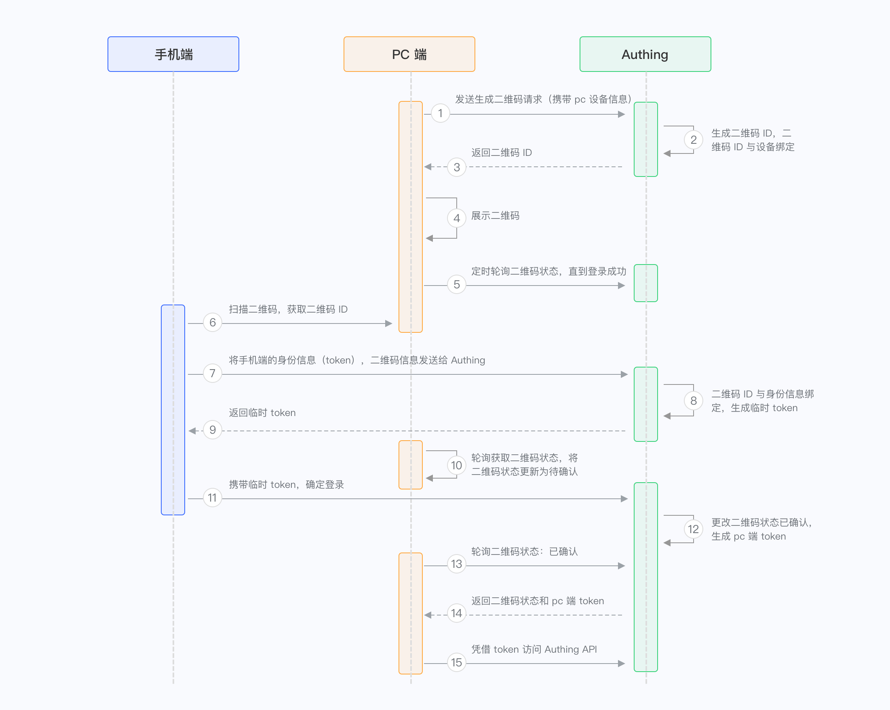

# 登录验证
## OTP
One Time Password，又称一次性口令、一次性密码、动态密码、单次有效密码。

OTP基于专门的算法每隔一定的时间间隔生成一个不可预测的随机数字组合。

OTP的密码有效期仅在一次会话或者交易过程中，因此不容易受到重放攻击。

OTP一般分为计次使用和计时使用两种，计次使用的OTP产出后，可在不限时间内使用；

计时使用的OTP则可设置密码有效时间，从30秒到两分钟不等，而OTP在进行认证之后即废弃不用，下次认证必须使用新的密码，降低了不经授权访问限制资源可能性。

OTP类型： 
1. 手机短信 
2. 手机令牌 
3. 硬件令牌 
4. 某些系统采用预打印方式提供一次性密码，比较少见

OTP认证流程：
1. 服务器端将用户账号与令牌种子建立关联。 
2. 当用户登录时，输入账号和动态令牌口令并将其提交至服务器，对比校验完成认证过程。

## 扫码登录
用一句话概括：扫码登录本质上是请求登录方请求已登录方将登录凭证写入特定媒介的过程。这里的请求登录方为 Web 端，已登录方为 APP 端，
登录凭证可以是用户信息，也可以是换取用户信息的凭证，而特定媒介是某一张二维码。

登录过程如图所示：

1. 打开登录页面，展示一个二维码，同时轮询二维码状态(web)
2. 打开APP扫描该二维码后，APP显示确认、取消按钮(app)
3. 登录页面展示被扫描的用户头像等信息(web)
4. 用户在APP上点击确认登录(app)
5. 登录页面从轮询二维码状态得知用户已确认登录，并获取到登录凭证(web)
6. 页面登录成功，并进入主应用程序页面(web)

