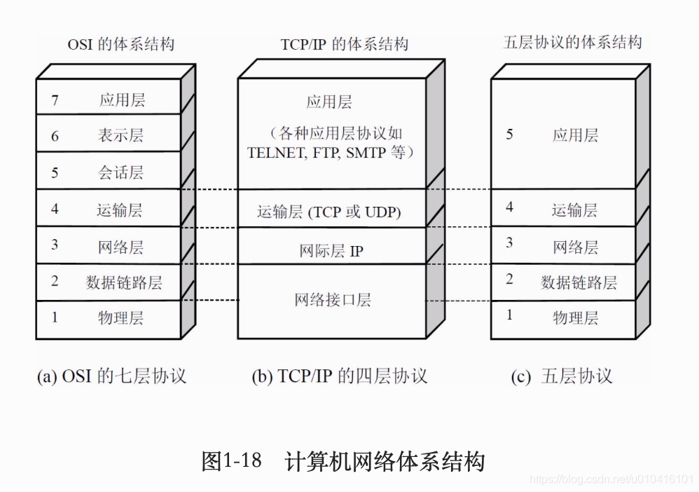

# 计算机
## 分层结构
### 七层模型
**OSI 七层模型** 是国际标准化组织提出一个网络分层模型
### 五层模型
为了方便理解教学中使用五层模型
### 四层模型
**TCP/IP 四层模型** 是目前被广泛采用的一种模型,我们可以将 TCP / IP 模型看作是 OSI 七层模型的精简版本

> 以下内容来自JavaGuide

#### 应用层

**应用层位于传输层之上，主要提供两个终端设备上的应用程序之间信息交换的服务，它定义了信息交换的格式，消息会交给下一层传输层来传输。** 我们把应用层交互的数据单元称为报文。

**应用层协议** :

- HTTP 协议（超文本传输协议，网页浏览常用的协议）
- DHCP 协议（动态主机配置）
- DNS 系统原理（域名系统）
- FTP 协议（文件传输协议）
- Telnet协议（远程登陆协议）
- 电子邮件协议等（SMTP、POP3、IMAP）
- SSH协议（Secure Shell 安全壳协议）
- ......

#### 传输层

**传输层的主要任务就是负责向两台终端设备进程之间的通信提供通用的数据传输服务。** 应用进程利用该服务传送应用层报文。“通用的”是指并不针对某一个特定的网络应用，而是多种应用可以使用同一个运输层服务。

**运输层主要使用以下两种协议：**

1. **传输控制协议 TCP**（Transmisson Control Protocol）—— 提供 **面向连接** 的，**可靠的** 数据传输服务。
2. **用户数据协议 UDP**（User Datagram Protocol）—— 提供 **无连接** 的，尽最大努力的数据传输服务（不保证数据传输的可靠性）。

<u>SSL在7层架构中属于会话层</u>

#### 网络层

**网络层负责为分组交换网上的不同主机提供通信服务。** 在发送数据时，网络层把运输层产生的报文段或用户数据报封装成分组和包进行传送。在 TCP/IP 体系结构中，由于网络层使用 IP 协议，因此分组也叫 IP 数据报，简称数据报。

**网络层的还有一个任务就是选择合适的路由，使源主机运输层所传下来的分组，能通过网络层中的路由器找到目的主机。**

**网络层协议**：

- IP 协议（TCP/IP 协议的基础，分为 IPv4 和 IPv6）
- ARP 协议（地址解析协议，用于解析 IP 地址和 MAC 地址之间的映射）
- ICMP 协议（控制报文协议，用于发送控制消息）
- NAT 协议（网络地址转换协议）
- RIP 协议、OSPF 协议、BGP 协议（路由选择协议）

#### 网络接口层

我们可以把网络接口层看作是数据链路层和物理层的合体。

1. 数据链路层(data link layer)通常简称为链路层（ 两台主机之间的数据传输，总是在一段一段的链路上传送的）。**数据链路层的作用是将网络层交下来的 IP 数据报组装成帧，在两个相邻节点间的链路上传送帧。每一帧包括数据和必要的控制信息（如同步信息，地址信息，差错控制等）。**
2. **物理层的作用是实现相邻计算机节点之间比特流的透明传送，尽可能屏蔽掉具体传输介质和物理设备的差异**

**网络接口层** :

- 差错检测技术
- 多路访问协议（信道复用技术）
- CSMA/CD 协议
- MAC 协议
- 以太网技术
- ......