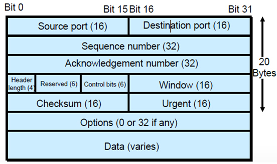

# 传输层协议
## 传输控制协议 TCP

特点：
- 面向连接的运输层协议 
- 每一条TCP连接只能有两个端点，每一条TCP连接只能时点对点的 
- 提供可靠交付服务 
- 提供全双工通信 
- 面向字节流

**运行于 TCP 协议之上的协议** ：
> 内容来自JavaGuide

1. **HTTP 协议** (3.0之前)：超文本传输协议（HTTP，HyperText Transfer Protocol)主要是为 Web 浏览器与 Web 服务器之间的通信而设计的。当我们使用浏览器浏览网页的时候，我们网页就是通过 HTTP 请求进行加载的。
2. **HTTPS 协议** ：更安全的超文本传输协议(HTTPS,Hypertext Transfer Protocol Secure)，身披 SSL 外衣的 HTTP 协议
3. **FTP 协议**：文件传输协议 FTP（File Transfer Protocol），提供文件传输服务，**基于 TCP** 实现可靠的传输。使用 FTP 传输文件的好处是可以屏蔽操作系统和文件存储方式。
4. **SMTP 协议**：简单邮件传输协议（SMTP，Simple Mail Transfer Protocol）的缩写，**基于 TCP 协议**，用来发送电子邮件。注意 ⚠️：接受邮件的协议不是 SMTP 而是 POP3 协议。
5. **POP3/IMAP 协议**： POP3 和 IMAP 两者都是负责邮件接收的协议。
6. **Telnet 协议**：远程登陆协议，通过一个终端登陆到其他服务器。被一种称为 SSH 的非常安全的协议所取代。
7. **SSH 协议** : SSH（ Secure Shell）是目前较可靠，专为远程登录会话和其他网络服务提供安全性的协议。利用 SSH 协议可以有效防止远程管理过程中的信息泄露问题。SSH 建立在可靠的传输协议 TCP 之上。
## 用户数据报协议 UDP

特点：
- 无连接：不需要先建立连接 
- 尽最大努力交付 
- 面向报文
- 没有拥塞控制 
- 支持一对一、一对多、多对多的交互通信 
- 首部开销小：8字节
