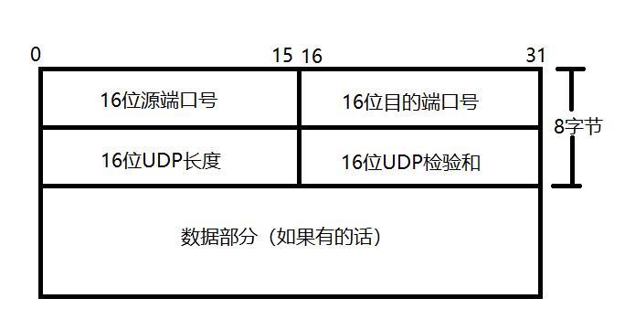

# 传输层协议
## 传输控制协议 TCP

特点：
- 面向连接的运输层协议 
- 每一条TCP连接只能有两个端点，每一条TCP连接只能时点对点的 
- 提供可靠交付服务 
- 提供全双工通信 
- 面向字节流

**运行于 TCP 协议之上的协议** ：
> 内容来自JavaGuide

1. **HTTP 协议** (3.0之前)：超文本传输协议（HTTP，HyperText Transfer Protocol)主要是为 Web 浏览器与 Web 服务器之间的通信而设计的。当我们使用浏览器浏览网页的时候，我们网页就是通过 HTTP 请求进行加载的。
2. **HTTPS 协议** ：更安全的超文本传输协议(HTTPS,Hypertext Transfer Protocol Secure)，身披 SSL 外衣的 HTTP 协议
3. **FTP 协议**：文件传输协议 FTP（File Transfer Protocol），提供文件传输服务，**基于 TCP** 实现可靠的传输。使用 FTP 传输文件的好处是可以屏蔽操作系统和文件存储方式。
4. **SMTP 协议**：简单邮件传输协议（SMTP，Simple Mail Transfer Protocol）的缩写，**基于 TCP 协议**，用来发送电子邮件。注意 ⚠️：接受邮件的协议不是 SMTP 而是 POP3 协议。
5. **POP3/IMAP 协议**： POP3 和 IMAP 两者都是负责邮件接收的协议。
6. **Telnet 协议**：远程登陆协议，通过一个终端登陆到其他服务器。被一种称为 SSH 的非常安全的协议所取代。
7. **SSH 协议** : SSH（ Secure Shell）是目前较可靠，专为远程登录会话和其他网络服务提供安全性的协议。利用 SSH 协议可以有效防止远程管理过程中的信息泄露问题。SSH 建立在可靠的传输协议 TCP 之上。

### 三次握手四次挥手

#### 三次握手

建立一个 TCP 连接需要“三次握手”，缺一不可：

- **一次握手**:客户端发送带有 SYN（SEQ=x） 标志的数据包 -> 服务端，然后客户端进入 **SYN_SEND** 状态，等待服务器的确认；
- **二次握手**:服务端发送带有 SYN+ACK(SEQ=y,ACK=x+1) 标志的数据包 –> 客户端,然后服务端进入 **SYN_RECV** 状态
- **三次握手**:客户端发送带有 ACK(ACK=y+1) 标志的数据包 –> 服务端，然后客户端和服务器端都进入**ESTABLISHED** 状态，完成 TCP 三次握手。

当建立了 3 次握手之后，客户端和服务端就可以传输数据啦！

三次握手的目的是建立可靠的通信信道，说到通讯，简单来说就是数据的发送与接收，而三次握手最主要的目的就是双方确认自己与对方的发送与接收是正常的。

1. **第一次握手**：Client 什么都不能确认；Server 确认了对方发送正常，自己接收正常
2. **第二次握手**：Client 确认了：自己发送、接收正常，对方发送、接收正常；Server 确认了：对方发送正常，自己接收正常
3. **第三次握手**：Client 确认了：自己发送、接收正常，对方发送、接收正常；Server 确认了：自己发送、接收正常，对方发送、接收正常

三次握手就能确认双方收发功能都正常，缺一不可。

#### 四次挥手

断开一个 TCP 连接则需要“四次挥手”，缺一不可：

1. **第一次挥手**：客户端发送一个 FIN（SEQ=x） 标志的数据包->服务端，用来关闭客户端到服务器的数据传送。然后客户端进入 **FIN-WAIT-1** 状态。
2. **第二次挥手**：服务器收到这个 FIN（SEQ=X） 标志的数据包，它发送一个 ACK （ACK=x+1）标志的数据包->客户端 。然后服务端进入 **CLOSE-WAIT** 状态，客户端进入 **FIN-WAIT-2** 状态。
3. **第三次挥手**：服务端发送一个 FIN (SEQ=y)标志的数据包->客户端，请求关闭连接，然后服务端进入 **LAST-ACK** 状态。
4. **第四次挥手**：客户端发送 ACK (ACK=y+1)标志的数据包->服务端，然后客户端进入**TIME-WAIT**状态，服务端在收到 ACK (ACK=y+1)标志的数据包后进入 CLOSE 状态。此时如果客户端等待 **2MSL** 后依然没有收到回复，就证明服务端已正常关闭，随后客户端也可以关闭连接了。

**只要四次挥手没有结束，客户端和服务端就可以继续传输数据！**

TCP 是全双工通信，可以双向传输数据。任何一方都可以在数据传送结束后发出连接释放的通知，待对方确认后进入半关闭状态。当另一方也没有数据再发送的时候，则发出连接释放通知，对方确认后就完全关闭了 TCP 连接。

举个例子：A 和 B 打电话，通话即将结束后。

1. **第一次挥手**：A 说“我没啥要说的了”
2. **第二次挥手**：B 回答“我知道了”，但是 B 可能还会有要说的话，A 不能要求 B 跟着自己的节奏结束通话
3. **第三次挥手**：于是 B 可能又巴拉巴拉说了一通，最后 B 说“我说完了”
4. **第四次挥手**：A 回答“知道了”，这样通话才算结束。

### 拥塞避免
1. **慢启动**算法的思想是为发送方增加了一个拥塞窗口（Congestion Window），记为cwnd。 

   每经过一个RTT，cwnd变为之前的两倍。发送方开始时发送initcwnd个报文段,当收到该ACK时，拥塞窗口扩大为initcwnd*2，
   继续发送，当再次收到这发出报文段的ACK时，拥塞窗口继续扩大为initcwnd*4,这是一种指数增加的关系
2. **拥塞避免**算法维护了一个慢启动阈值ssthresh

    当cwnd>ssthresh时，拥塞窗口使用拥塞避免算法，按线性增长。拥塞避免算法每经过一个RTT，拥塞窗口增加initcwnd。

    当发生拥塞时，ssthresh需要置为没有被确认包的一半，但是不小于两个MSS。此外，如果是超时引起的拥塞，则cwnd被置为initcwnd
    
    
3. 当发送方收到3个或以上重复确认时，就意识到相应的包已经丢了，从而立即重传它。这个过程称为**快重传**。
4. 如果在拥塞阶段发生了快速重传时将慢启动阈值ssthreh设置为没有被确认包的1/2，但是不小于2个MSS。拥塞窗口设置为慢启动阈值加3个MSS。这个过程被称为快速恢复

## 用户数据报协议 UDP

特点：
- 无连接：不需要先建立连接 
- 尽最大努力交付 
- 面向报文
- 没有拥塞控制 
- 支持一对一、一对多、多对多的交互通信 
- 首部开销小：8字节
